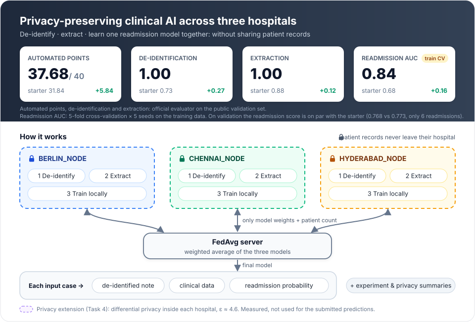

# Privacy-Preserving Clinical AI across Three Hospital Nodes

<p align="center">
  
</p>

Solution to the take-home challenge described in [`docs/CHALLENGE_README.md`](docs/CHALLENGE_README.md).
Three synthetic hospitals (`BERLIN_NODE`, `CHENNAI_NODE`, `HYDERABAD_NODE`) hold short clinical
notes. For every note this repository

1. **de-identifies** it — finds names, dates, addresses, phone numbers, IDs and e-mails and replaces them (Task 1);
2. **extracts clinical data** — diagnoses, medications, vital signs, lab values, LVEF, smoking and allergy, in the canonical vocabulary and units (Task 2);
3. **predicts 30-day readmission** with a **federated model**: each hospital node trains on its own patients and only model weights are exchanged (FedAvg), compared with local and centralized models (Task 3);
4. adds **differential privacy** inside each hospital node as the privacy mechanism, with a written threat model and a measured privacy/accuracy trade-off (Task 4).

All data are synthetic. The analysis and reasoning are in [`REPORT.md`](REPORT.md); AI tool use is disclosed in [`AI_USAGE.md`](AI_USAGE.md).

---

## Results at a glance

**Public validation set (official evaluator, `make evaluate`)**

| | Starter (as supplied) | My submission |
|---|---|---|
| De-identification score | 0.7279 | **1.0000** |
| Structured extraction score | 0.8797 | **1.0000** |
| Readmission prediction score | 0.7726 | 0.7679 |
| **Automated points** | 31.84 / 40 | **37.68 / 40** |

Starter values were measured before any change (`docs/ai_log.md`, Phase 0). The validation set has only 30 patients, 6 of them readmitted, so the readmission model was selected on the 120 training patients (below), never on validation. There it ranks patients far better than the starter's model (ROC AUC 0.843 vs 0.683) and gives more accurate probabilities (Brier score 0.142 vs 0.222).

**Readmission on the training data (5-fold cross-validation × 5 seeds, `results/`)**

| Model | ROC AUC | Brier | Berlin / Chennai / Hyderabad AUC |
|---|---|---|---|
| Starter's model, as supplied (structured fields + hospital) | 0.683 ± 0.023 | 0.222 | 0.54 / 0.74 / 0.71 |
| Local models (one per hospital) | 0.754 ± 0.016 | 0.183 | 0.52 / 0.85 / 0.83 |
| **Federated model (FedAvg, submitted)** | **0.843 ± 0.024** | **0.142** | 0.67 / 0.90 / 0.94 |
| Centralized model (all data pooled, reference only) | 0.841 ± 0.025 | 0.139 | 0.66 / 0.90 / 0.94 |

Two more notes:

- **1.0000 for de-identification and extraction** means the known note formats are fully covered. The hidden test set uses new formats, so lower scores are expected there; hand-written notes in unseen formats are part of the tests.
- **Privacy:** with differential privacy at ε ≈ 4.6 (δ = 10⁻⁵) the private federated model still reaches AUC 0.734 ± 0.037, above the starter. The submitted predictions come from the non-private federated model; see [Privacy](#privacy-task-4).

---

## Quick start

Requires Python 3.11, 3.12 or 3.13 (all pinned versions install on each; CPU only).

```bash
python -m pip install -r requirements.txt
make test        # 193 tests, about 10 s
make evaluate    # runs the standard command on validation and scores it (about 3 s)
```

`make evaluate` prints the four scores above and writes `outputs/validation_report.json`.

## The standard command

This is the command from the challenge, unchanged; the same command is used for the hidden set:

```bash
python run_submission.py \
  --train data/train.jsonl \
  --input data/validation_inputs.jsonl \
  --output outputs/validation_predictions.jsonl \
  --artifacts-dir outputs/artifacts
```

| Written to | Content |
|---|---|
| `--output` | one JSON object per input case: `pii_entities`, `deidentified_text`, `extracted_clinical_data`, `readmission_probability` (checked against `schemas/prediction.schema.json` by the tests) |
| `--artifacts-dir/experiment_summary.json` | local, federated and centralized metrics overall and by site; FedAvg settings (rounds, local epochs, optimizer, client weighting, seeds); communication payload and what leaves each client; convergence; non-IID observations; limitations |
| `--artifacts-dir/privacy_summary.json` | mechanism and status, protected asset, adversary and trust assumptions, privacy parameters (C, σ, T, δ, ε), exact privacy claim and what it does not guarantee, utility and runtime comparison, remaining attack surface |

The command reads **only** `--train` and `--input`; it never opens a ground-truth file (a test checks every file it opens). Both summaries are measured during the run from the training data; no number in them is typed in by hand.

If one case fails at any step, the run continues and still writes a valid record for it: a failed de-identification redacts the whole note, a failed extraction leaves the fields empty, a failed prediction uses the training readmission rate. Each case is logged as a warning.

## Docker (offline)

```bash
docker build -t charite-fl .

docker run --rm --network none --cpus 4 --memory 16g \
  -v "$PWD/data:/data:ro" -v "$PWD/outputs:/out" charite-fl \
  --train /data/train.jsonl --input /data/validation_inputs.jsonl \
  --output /out/validation_predictions.jsonl --artifacts-dir /out/artifacts
```

For the hidden set, mount its folder and pass its file as `--input`. The tests can also run inside the image:

```bash
docker run --rm --network none --entrypoint python charite-fl -m pytest -q
```

Measured on the development machine (Docker 29.4, Python 3.11.16 in the image):

| | |
|---|---|
| Image size | 634 MB (`python:3.11-slim` + pinned packages; no model weights, no downloads at runtime) |
| Standard command, offline, 4 CPUs / 16 GB | 8.4 s including container start (limit: 30 min) |
| Tests inside the image, offline | 193 passed |
| Output vs a local run on macOS / Python 3.13 | identical de-identification and extraction; probabilities within 2 × 10⁻¹⁵; 37.68 / 40 |

`.dockerignore` keeps `.git`, virtual environments, `outputs/` and local working files out of the image.

---

## How it works

```
 note ──► de-identification (src/deid) ───────────► pii_entities, deidentified_text
   └────► extraction (src/extraction) ────────────► extracted_clinical_data
                               │
                               ▼  9 features (src/readmission.py)
          ┌───────────────── FedAvg, 50 rounds ─────────────────┐
          │  BERLIN_NODE     CHENNAI_NODE     HYDERABAD_NODE     │  each client trains on
          │       │ weights + patient count (nothing else)       │  its own patients only
          │       ▼                                              │
          │  server: weighted average of the weights (n_k / N)   │
          └──────────────────────────────────────────────────────┘
                               ▼
                   readmission_probability
   privacy extension (src/privacy.py): clip each patient's influence + add noise inside each node
```

- **De-identification** (`src/deid/`) — rules for each kind of identifier (e-mails, phone numbers, dates, IDs), names found after cues such as `Patient:` or `Attending physician:` and then at every repeat, clinician names recovered from e-mail addresses, and addresses up to the postcode and city. Dates are labelled as birth or encounter dates from nearby words. Overlaps are resolved by a fixed priority.
- **Extraction** (`src/extraction/`) — a lexicon of diagnosis and medication names (brands, abbreviations, German terms) mapped to the canonical vocabulary; negation within the same clause ("denies COPD", "considered but not confirmed", "family history of …"); unit conversion (creatinine µmol/L → mg/dL, haemoglobin g/L → g/dL, decimal commas) with plausibility checks; `null` when a value is not documented.
- **Readmission models** (`src/readmission.py`) — one small file in the starter's style: `Pipeline(DictVectorizer, LogisticRegression)`. Nine features: age, prior admissions, heart failure, chronic kidney disease, atrial fibrillation, LVEF (+ missing flag), haemoglobin, number of medications. Values are scaled with fixed numbers written in the code, so no statistics are shared between hospital nodes. `train_local`, `train_centralized` and `train_federated` (FedAvg written out by hand: warm-started local fit on each client's own patients, weighted averaging of the weights on the server).
- **Privacy** (`src/privacy.py`) — see below.
- **Summaries** (`src/experiment_summary.py`, `privacy.summary`) — recomputed from `--train` at every run.

## Privacy (Task 4)

Federated learning keeps patient rows inside each hospital node, but the weights a client sends are computed from its patients. The leakage demo shows that one patient's features can be recovered **exactly** from a one-patient update. Differential privacy is added inside each client, every round, before anything leaves it:

1. compute each patient's gradient; 2. clip it to length C; 3. add the clipped gradients up and add Gaussian noise (standard deviation σ·C); 4. divide by the public patient count and take one step.

A privacy accountant written in the repository (Rényi differential privacy of the Gaussian mechanism over T rounds, checked against known reference values) turns σ and T into ε.

| Privacy setting (C = 1 unless noted) | ε (δ = 10⁻⁵) | ROC AUC (train CV) |
|---|---|---|
| no noise | ∞ | 0.820 |
| σ = 2, 50 rounds | 23.2 | 0.821 |
| σ = 4, 50 rounds | 10.0 | 0.800 |
| **σ = 8, C = 0.5, 50 rounds (reference)** | **4.6** | **0.734** |

Leakage demo, one Berlin patient (similarity between recovered and true features; 1 = exact copy): no noise **1.00**, σ = 0.5 → 0.39, σ = 1 → 0.13, σ ≥ 2 → about 0.

The reference setting was chosen by a rule fixed before running: the smallest ε whose mean AUC minus one standard deviation stays above the starter's 0.683. The claim, its assumptions and what it does not cover are in `privacy_summary.json` and `REPORT.md` §6. The submitted predictions come from the non-private federated model; the private model is fully implemented, tested and measured (the challenge asks to "implement or rigorously prototype" one mechanism).

---

## Repository map

```
run_submission.py          standard entry point: reads --train/--input, writes predictions + both summaries
src/
  deid/                    Task 1: detector.py (rules), patterns.py (shapes and cue words), render.py
  extraction/              Task 2: lexicon.py, negation.py, numeric.py, categorical.py, extractor.py
  readmission.py           Task 3: 9 features; local / centralized / federated (FedAvg) models
  privacy.py               Task 4: private local update, private FedAvg, accountant, leakage demo, privacy summary
  experiment_summary.py    experiment_summary.json, recomputed from --train at every run
  baseline.py              the unmodified starter, kept for reference; not used by the submission
scripts/
  run_experiments.py       every experiment behind results/ (about 100 s)
  error_analysis.py        per-field mistakes of Tasks 1-2 on train or validation
results/                   committed experiment outputs quoted in REPORT.md
tests/                     one test file per part, plus end-to-end tests
docs/CHALLENGE_README.md   the original challenge text
docs/ai_log.md             session-by-session log of AI-assisted work (source for AI_USAGE.md)
data/, evaluator/, schemas/, *.md from the challenge   supplied files, unchanged (MANIFEST.sha256)
```

## Reproducing the experiments

```bash
python scripts/run_experiments.py        # rewrites everything in results/ (about 100 s)
python scripts/error_analysis.py --split validation   # mistakes of de-identification and extraction
```

| File in `results/` | Question it answers |
|---|---|
| `model_comparison_cv.csv`, `model_comparison_validation.csv` | local vs federated vs centralized model, overall and by site |
| `starter_cv.csv` | the starter's model under the same folds |
| `settings_selection.csv`, `settings_selection_check.csv` | how C and the number of rounds were chosen; an estimate that includes that choice |
| `convergence.csv` | how the federated model improves round by round |
| `local_updates_comparison.csv` | 1 / 2 / 5 local updates per round (client drift) |
| `local_models_on_other_sites.csv`, `leave_one_site_out.csv` | how models carry over between hospitals (non-IID data) |
| `seed_stability.csv` | the federated model from zeros vs 5 random starting points |
| `feature_set_comparison.csv`, `prior_admissions_check.csv` | what the extracted features add; whether prior admissions dominate |
| `model_family_comparison.csv` | logistic regression vs random forest vs gradient boosting |
| `privacy_sweep.csv`, `leakage_demo.csv`, `privacy_validation.csv` | privacy/accuracy trade-off; leakage without and with noise |
| `federated_experiment.json` | settings, features, communication payload, runtimes |

The script stops with a message if its own selection rules would pick settings different from those used by the submission, so the code and `results/` cannot drift apart.

## Seeds and nondeterminism

- Fixed seeds: model seed 7; cross-validation seeds 7, 19, 43, 101, 202 (3 of them in the run-time summaries); differential-privacy noise is drawn from seeded generators per hospital node.
- The federated model starts from zero weights and all training steps are deterministic, so **predictions are identical on every run** (tested).
- The only values that change between runs are the **measured seconds** in the two summaries and `results/`.
- Across platforms (Docker Linux / Python 3.11 vs macOS / Python 3.13) probabilities agree within 2 × 10⁻¹⁵.

## Tests

`make test` — 193 tests:

| File | Checks |
|---|---|
| `test_deid.py` (18) | offsets and non-overlap, rendering identical to the evaluator's, clinician names without "Dr.", repeated names, headers and clinical values never redacted, three hand-written notes in unseen formats |
| `test_extraction.py` (116) | surface forms and brands, negation cues with positive controls, unit conversion, `null` for missing values, three hand-written notes in unseen formats, the training-set score |
| `test_readmission.py` (13) | the 9 features and fixed scaling, the weighted average against a hand calculation, each client update seeing only its own hospital's patients, federated close to centralized, determinism |
| `test_privacy.py` (27) | clipping, "no noise = a plain gradient step", ε against reference values, the leakage demo, the privacy summary |
| `test_submission.py` (7) | the standard command end to end, schema validation of every output line, both summaries complete, no ground-truth file opened, safe handling of failing cases |
| `test_error_analysis.py` (9), `test_evaluator.py` (1), `test_smoke.py` (2) | the error-analysis tool agrees with the evaluator; the starter's original checks |

## Requirements and limits

- Python 3.11–3.13; pinned `requirements.txt` (numpy, scikit-learn, scipy; pytest and jsonschema for the tests).
- CPU only, no network at runtime, no pretrained models or downloaded weights.
- Runtime: about 3 s locally, 8.4 s in Docker; the challenge allows 30 minutes.

## Further documents

- [`REPORT.md`](REPORT.md) — method, error analysis, federated experiment, threat model, limitations.
- [`AI_USAGE.md`](AI_USAGE.md) — which AI tools were used, for what, and how their output was checked.
- Challenge files: [`DATA_CARD.md`](DATA_CARD.md), [`DATA_DICTIONARY.md`](DATA_DICTIONARY.md), [`SUBMISSION_SCHEMA.md`](SUBMISSION_SCHEMA.md), [`REPORT_TEMPLATE.md`](REPORT_TEMPLATE.md).
