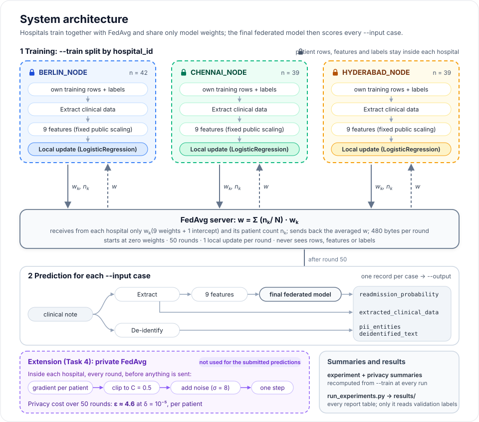

# REPORT — Privacy-Preserving Clinical AI across Three Hospital Nodes

All numbers in this report come from `results/` (rebuilt by `python scripts/run_experiments.py`),
from `make evaluate` on the public validation set, or — for the starter — from the measurement taken
before any change (`docs/ai_log.md`, Phase 0). Readmission results on the training data use 5-fold
cross-validation stratified by site and label, repeated with seeds 7, 19, 43, 101 and 202, and are
reported as mean ± standard deviation over the five repeats.

---

## 1. Executive summary

I built a rule-based pipeline for de-identification and clinical data extraction, a federated
readmission model trained with FedAvg across the three hospital nodes, and differential privacy
inside each node as the privacy mechanism.

- **Automated validation score: 37.68 / 40** (starter 31.84). De-identification and extraction are
  exact on the training and validation notes (1.0000); new formats in the hidden set will lower this.
- **Readmission:** a logistic regression on 9 features (age, prior admissions, heart failure, chronic
  kidney disease, atrial fibrillation, LVEF, haemoglobin, number of medications). On the training
  data the federated model reaches ROC AUC 0.843 ± 0.024 against 0.754 for local models and 0.683
  for the starter's model, and matches the centralized reference (0.841). Validation (30 cases,
  6 readmitted) is too small to rank models.
- **Non-IID data:** Berlin is the hardest site for every model; trained on two nodes, the federated
  model still ranks the third well (AUC 0.72 / 0.92 / 0.95).
- **Privacy:** one patient's features can be recovered exactly from a plain federated update. With
  differential privacy at ε ≈ 4.6 (δ = 10⁻⁵) the private model keeps AUC 0.734, above the starter.

---

## 2. System architecture

`run_submission.py` reads only `--train` and `--input` and runs in three steps:

1. **Training (Task 3).** The `--train` rows are split by `hospital_id` into three clients. Each
   client extracts the clinical data from its own notes, builds the 9 features with fixed public
   scaling, and runs one local update of `LogisticRegression` per round. It sends only its weights
   wk (9 weights + 1 intercept) and its patient count nk. The server averages
   them as w = Σ (nk / N) · wk and sends w back. There are 50 rounds, starting
   from zero weights.
2. **Prediction (Tasks 1–3).** Every `--input` note is de-identified and its clinical data is
   extracted. The same 9 features go into the final federated model, which gives
   `readmission_probability`. Each case gives one output record.
3. **Summaries.** `experiment_summary.json` (cross-validation of the local, federated and centralized
   models) and `privacy_summary.json` (the private FedAvg variant and its ε, Task 4) are recomputed
   from `--train` at every run.

**The hospitals are simulated.** All three clients run in one Python process, as separate calls on
their own rows. They are not separate machines and nothing is sent over a network. The isolation is
enforced in the code instead: `local_update` receives one hospital's rows and returns only
`(coef, intercept, n)`, and the tests check that every local update sees exactly one hospital's
rows. A real deployment would put the same client code at each hospital and replace the function
call with a network message carrying the same 10 numbers and count.

The private variant (dashed box) is fully implemented and measured, but the submitted predictions
come from the non-private federated model (§6 explains this choice). `scripts/run_experiments.py`
produces every table in `results/` and is the only code that reads validation labels.

| Component | Files | Idea in one line |
|---|---|---|
| De-identification | `src/deid/` | shapes find identifiers, cue words decide names and date types, a fixed priority removes overlaps |
| Extraction | `src/extraction/` | lexicon to canonical terms, negation within the clause, unit conversion, `null` when absent |
| Readmission | `src/readmission.py` | `Pipeline(DictVectorizer, LogisticRegression)`; local, centralized and federated (FedAvg) models |
| Privacy | `src/privacy.py` | clip each patient's gradient, add Gaussian noise inside the client, count ε with an accountant |
| Summaries | `src/experiment_summary.py`, `privacy.summary` | recomputed from `--train` at every run; no hand-typed numbers |

The same feature function is used for training rows and evaluation rows, so the model sees the same
extraction behaviour in both. A case that fails at any step still produces a valid record (§7).

---

## 3. De-identification

**Method.** Six layers, each explainable:

1. **Shapes** for identifiers with a clear form: e-mail, international and national phone numbers,
   dates (`16/08/1976`, `25-May-1969`, `03 Jan 1971`, ISO), and site-style IDs (`B-288949`,
   `CHN-3601789`, `HYD319884`, generic `PREFIX-digits`).
2. **Date type from context:** a date near `DOB`, `born`, `d.o.b.` is a birth date; near `Visit`,
   `Admission`, `DOA`, `seen`, `Encounter date` it is an encounter date; without a cue the earliest
   date is the birth date.
3. **Names after cues:** patient cues (`Patient:`, `Name:`, `Pt`, a name before `, born` or `/ ID`)
   and clinician cues (`Attending physician:`, `Consultant:`, `Treating clinician:`, `Reviewed by`,
   `Author:`, `Signed:` …). The title (`Dr.`) is kept outside the span, as in the labels.
4. **Propagation:** every repeat of a detected name is labelled; clinician names are also rebuilt
   from the e-mail address (`emil.brandt@…` → `Emil Brandt`, with `oe/ue` → `ö/ü` so that
   `philipp.krueger` finds `Philipp Krüger`).
5. **Addresses** from cues (`Address:`, `Residence:`, `Home:`, `from … ;`) up to the postcode and
   city, with fallbacks for `…, 10785 Berlin` and `…, Chennai 600096`.
6. **Conflict resolution** by evidence priority, then length, then position, so the output never
   depends on the order in which the layers ran; spans never overlap.

**Controls against over-redaction.** Ambiguous shapes need a cue; a name must contain lower-case
letters, so an all-capitals banner (`SYNTHETIC BERLIN CLINICAL SUMMARY`) can never become a name;
clinical values, `Age/Sex: 57/M`, drug and diagnosis names are never redacted (tested). The three
hand-written notes in unseen formats produced **no span beyond the hand-labelled set**.

**Results.**

| | Starter (validation) | Mine (train, 120 notes) | Mine (validation, 30 notes) |
|---|---|---|---|
| De-identification score | 0.7279 | 1.0000 | **1.0000** |
| Character recall (1 − leakage) | 0.543 | 1.000 | 1.000 |
| `PATIENT_NAME` / `ADDRESS` / `CLINICIAN_NAME` found | 0 / 0 / 0 of 30 / 30 / 45 | all | all |
| False positives | — | 0 | 0 |

**Error analysis (concrete cases).**

- *Starter, false negatives:* it had no rule for names or addresses, so every `PATIENT_NAME`,
  `ADDRESS` and `CLINICIAN_NAME` leaked (46 % of all personal-data characters).
- *My own bug, a boundary error:* my first name pattern allowed a line break between words, so
  `Treating clinician: Deepa Naidu⏎Dx` became the three-word name `Deepa Naidu Dx`. Every clinician
  span was one token too long — 85 false positives and 85 false negatives — while character recall
  still looked perfect. The per-label table of `scripts/error_analysis.py` exposed it; names now stop
  at a line break.
- *Unseen formats:* three hand-written notes (a UK letter with `d.o.b.` and `03 Jan 1971` and a
  national phone number; ISO dates with an `LIS-88-01422` identifier; prose with slash separators)
  are fully found. They are my only evidence for the hidden formats, because train and validation
  share the same six templates. A clinician name mentioned only with a title (`Dr. Sarah Klein
  reviewed the case`) was found to leak in a probe and is now handled.
- *Remaining risk:* a name with no cue and no repeat, names in non-Latin scripts, nicknames, and
  relatives' names in free prose.

**Extension to other modalities.** The detector works on text plus character offsets, which extends
to other data:

- **Scanned documents:** OCR with word boxes → the same detector on the OCR text → map each span to
  its boxes → black out those pixels. Low OCR confidence should lead to redacting more, not less.
- **DICOM images:** remove or replace identifying header tags (name, IDs, dates, institution)
  following the standard de-identification profiles; OCR burned-in text in the pixels and redact it
  as above; for head scans, remove the face (defacing).
- **Photos and video:** face and badge detection with blurring; audio via speech recognition with
  word timestamps, then silence the matched segments.
- **Indirect identifiers:** rare diagnoses, extreme ages and exact dates can identify a patient
  together; dates can be shifted by a per-patient offset and ages above 89 grouped.

---

## 4. Structured extraction and standardization

**Terminology normalization.** A lexicon maps every surface form seen in the training notes plus
common variants to the canonical vocabulary: `AF`, `Vorhofflimmern` → `atrial_fibrillation`;
`HFrEF`, `congestive cardiac failure`, `LV failure` → `heart_failure`; `CKD-3`, `chronic renal
dysfunction` → `chronic_kidney_disease`; brands to generics (`Eliquis`, `APX` → `apixaban`; `Lasix`,
`frusemide` → `furosemide`; `ASA`, `ecosprin` → `aspirin`). Short abbreviations are matched
case-sensitively with word boundaries, so `CAD` never matches inside `COAD` (which is COPD) and `EF`
never matches inside `HFrEF`. Look-alike diseases are excluded (pulmonary hypertension, type 1
diabetes, diabetes insipidus). Two mappings follow the training labels on purpose: bare "diabetes
mellitus" → `type_2_diabetes`, and phenprocoumon → `warfarin`.

**Negation handling.** A mention is dropped when a cue in the same clause refers to it:

- cues before the term (`denies`, `no`, `no evidence of`, `family history`, `suspected`, `?AF`),
  cues after it (`was considered but not confirmed`, `ruled out`, `discussed but was not started`),
  and relatives on either side (`mother had AF`);
- a clause ends at a sentence end, `;`, `|` or a line break, and the scope stops at `but` or
  `however`, so "No known drug allergies. Diagnoses: HTN." keeps the hypertension;
- a cue *after* a term covers only the list item it follows: in "HTN, T2DM, AF ruled out" only AF
  is dropped;
- "considered-only" and "suspected" count as not active, as the data dictionary requires.

**Unit conversion and missing values.** Creatinine µmol/L ÷ 88.4 and mmol/L → mg/dL; haemoglobin
g/L ÷ 10 and mmol/L → g/dL; decimal commas (`1,04`); LVEF ranges (`35-40 %` → 38); systolic from
`BP 110/61` and `140 over 86`. Values outside plausible ranges are discarded and logged. A value that
is not documented ("ejection fraction not documented", "vital signs not captured") is `null`, never 0.

**Validation results.** Extraction score **1.0000** on validation (starter 0.8797) and on training:
diagnoses 52/52, medications 59/59, all numeric fields within tolerance, smoking and allergy 30/30.
The starter found only 52 % of validation diagnoses and missed every creatinine in µmol/L and every
haemoglobin in g/L.

**Error analysis.** The labelled data showed no remaining errors, so I wrote three notes in unseen
formats (a UK letter, a German key-value export with mmol/L haemoglobin, a terse ward note). They
exposed four bugs the labelled data never showed:

1. a cue after a term covered the whole comma list ("HTN, T2DM, … AF ruled out" dropped HTN and T2DM);
2. "DM type 2" was not recognised;
3. the German field label `Raucher:` ("smoker:") was read as a current smoker even before
   "Nichtraucher";
4. a `?` directly before a term (`?COPD`) was treated as a sentence end, so the "query" cue was lost.

A fifth fix came from a training note: "ibuprofen-associated urticaria" needed reaction words
(urticaria, hives, angioedema) to count as an NSAID allergy. All five are now tests. German "RR"
is deliberately not read as blood pressure because it also means respiratory rate.

---

## 5. Federated-learning experiment

**Data partitioning.** The training file is split by `hospital_id`; each client holds only its own
rows, and the server receives only model weights and the row count.

| Site | Training rows | Readmission rate |
|---|---|---|
| BERLIN_NODE | 42 | 0.357 |
| CHENNAI_NODE | 39 | 0.436 |
| HYDERABAD_NODE | 39 | 0.231 |

**Model and features.** Logistic regression with L2 penalty (sklearn, C = 10) on 9 features taken
from the structured features and the extracted clinical data. Values are scaled with fixed numbers
written in the code (for example `(age − 60) / 15`, capped at ±3), so no statistics are shared
between nodes; a missing LVEF becomes 0 plus a "missing" flag. The same model, features and settings
are used for the local, federated and centralized models.

*How the 9 features were chosen.* Adding the 9 extracted fields as they are (about 48 columns) over-
fitted: with 41 readmissions, fewer and stronger features work better. A feature study on the
training data (duplicates removed, several ranking methods, the choice repeated inside every
training fold) pointed to the same core — chronic kidney disease, heart failure, number of diagnoses,
atrial fibrillation, prior admissions and age — and I removed the weakest features from my earlier
14-feature set. Because this choice looked at the training data, the training scores are somewhat
optimistic; validation was never used for it.

**FedAvg.** 50 rounds. In each round every client starts from the server's weights and makes one
local update over all its patients (one L-BFGS step of sklearn's `LogisticRegression` with warm
start); the server takes the weighted average with weights n_k / N. The model starts from zero
weights. The number of rounds and C were chosen on the training data with a rule fixed in advance
(lowest federated log loss; ties to fewer rounds): C = 10 and 50 rounds (`settings_selection.csv`).
Repeating that choice inside every training fold gives AUC **0.835 ± 0.036**, the honest estimate.

**Results (training data).**

| Model | ROC AUC | Average precision | Brier | Berlin AUC | Chennai AUC | Hyderabad AUC |
|---|---|---|---|---|---|---|
| Starter's model (structured + hospital, balanced) | 0.683 ± 0.023 | — | 0.222 | 0.539 | 0.744 | 0.714 |
| Local models | 0.754 ± 0.016 | 0.675 | 0.182 | 0.523 | 0.850 | 0.833 |
| **Federated model** | **0.843 ± 0.024** | **0.782** | **0.142** | **0.670** | **0.897** | **0.939** |
| Centralized model (reference) | 0.841 ± 0.025 | 0.780 | 0.139 | 0.659 | 0.896 | 0.942 |

The federated model is better than the local models at every site and matches the centralized
reference, as expected for a model of this kind on three similar sites.

**Validation (30 cases, 6 readmitted).** Federated AUC 0.812, Brier 0.141; centralized 0.806 / 0.141;
local 0.736 / 0.145. Per site there are 1–3 readmitted patients, so per-site AUCs (for example 1.000
at Chennai, 0.222 at Hyderabad with a single readmitted patient) carry no information. The official
readmission score is 0.7679 against the starter's 0.7726; with six readmitted patients, moving one of
them from the bottom to the top of the ranking changes AUC by up to 0.17, so this gap is not a
meaningful difference, and the model was selected on the training data only.

**Convergence** (`convergence.csv`, held-out AUC after each round, averaged over folds): 0.705 after
round 1, 0.821 after 10, 0.850 after 20, 0.863 after 50; the log loss falls from 0.574 to 0.449.

**Local updates and client drift** (`local_updates_comparison.csv`): with 1, 2 and 5 local updates per
round the federated AUC is 0.843, 0.842 and 0.834, while the centralized model stays at 0.841. More
local work lets the clients drift towards their own data, so I use one local update per round.

**Non-IID data and site-specific performance.**

- *Local models on other sites* (`local_models_on_other_sites.csv`): Chennai's and Hyderabad's models
  work on each other's patients (0.86 / 0.86) and on Berlin only moderately (0.69); Berlin's own model
  is near chance even at home (0.52).
- *Leave one site out* (`leave_one_site_out.csv`): the federated model trained on two nodes ranks
  the third with AUC 0.724 (Berlin), 0.917 (Chennai) and 0.952 (Hyderabad), against 0.601 / 0.777 /
  0.811 with the structured features alone. The model learned risk that carries over to a hospital it
  never saw.
- Berlin is the hardest site for every model; its readmissions relate to the features differently
  (for example, none of its training patients has chronic kidney disease, the strongest feature
  elsewhere). Sharing helps Berlin most: 0.52 locally, 0.67 federated.
- Local fine-tuning of the federated model per hospital was tried during development and made every
  site worse, so the federated model is used unchanged.

**Random-seed stability** (`seed_stability.csv`): starting from zeros or from five random starting
points gives AUC 0.842–0.845. Single probabilities can differ by up to 0.28 between starts, because
one L-BFGS update per client per round does not settle exactly on the optimum. The submitted model
always starts from zeros, so the submission itself is fully repeatable.

**Is the centralized comparison fair?** Yes in the sense that all three models share features,
settings, folds and model type, and the centralized model trains on exactly the rows the federated
model is allowed to see. Two caveats: the centralized model is an upper reference that real hospitals
could not run, and the local models reuse the federated model's setting C = 10 instead of their own.

**What is exchanged.** Per round, each client sends 10 numbers (9 weights + 1 intercept, float64) and
its row count; the server sends back the averaged 10 numbers: 480 bytes per round, 24 KB for the
whole training. No patient rows, features or labels leave a client.

**What the extracted features add and what they depend on.** Structured features alone (age, prior
admissions) give a federated AUC of 0.715; with the extracted clinical data it is 0.843
(`feature_set_comparison.csv`). All six training patients with a prior admission were readmitted, so I
checked for a shortcut: without prior admissions the federated AUC is 0.834 (`prior_admissions_check.csv`)
— the model does not depend on it.

**Other model families** (`model_family_comparison.csv`, same folds and features): random forest
0.779 federated (each hospital shares its forest, predictions averaged by n_k / N) and 0.807
centralized; gradient boosting 0.800 even when trained on all data at once. Logistic regression is
both the best and the simplest to federate here. I also tried a neural network for tables (TabNet)
in a separate environment; it was clearly worse, and it is not part of this repository because it
needs PyTorch.

---

## 6. Privacy extension and threat model

**Why federated learning alone is not a privacy guarantee.** Patient rows stay inside each node, but
the weights a client sends are computed from its patients. For a logistic regression with an
intercept, a one-patient update gives `(p − y) · x` for the weights and `(p − y)` for the intercept,
so dividing recovers the patient's features **exactly**. The leakage demo (`leakage_demo.csv`, one
Berlin patient) confirms it: similarity between recovered and true features 1.000 without noise.

**Mechanism: differential privacy inside each client** (`src/privacy.py`). Every round, before
anything leaves the node:

1. compute each patient's gradient;
2. clip it to length C, so no single patient can move the sum by more than C;
3. add the clipped gradients and add Gaussian noise with standard deviation σ · C;
4. divide by the client's (public) patient count and take one gradient step.

The server averages the noisy weights exactly as in FedAvg. A privacy accountant written in the
repository counts the privacy cost: each round is a Gaussian mechanism with Rényi privacy
α / (2σ²); T rounds add up; the best order α converts the total to (ε, δ). It reproduces the
reference values for 40 rounds (σ = 1, 2, 4, 8 → ε = 50.3, 20.2, 8.8, 4.1) and is tested against the
closed-form bound. Training uses all of a client's patients every round, so no amplification by
sampling is claimed.

**Protected information.** One patient's record (features and readmission label), and whether that
patient is in a hospital's training data.

**Adversary.** An honest-but-curious server that sees every update; the other hospital nodes; anyone
who sees the final model.

**Trust assumptions.** Each hospital clips and adds the noise honestly; the noise comes from an
unpredictable random source; hospital patient counts are public; each patient belongs to one hospital.

**Parameter choices** (`privacy_sweep.csv`, same folds). Without noise, a step size of 4.0 matches the
submitted model (log loss 0.449). I swept σ ∈ {0, 0.5, 1, 2, 4, 8}, C ∈ {0.5, 1} and 20 or 50 rounds,
and fixed the rule in advance: the smallest ε whose mean AUC minus one standard deviation stays above
the starter's 0.683. It selects **C = 0.5, σ = 8, 50 rounds, δ = 10⁻⁵, ε ≈ 4.6**.

**Privacy claim.** (4.6, 10⁻⁵)-differential privacy with respect to adding or removing one patient at a
single hospital, for all updates that hospital sends and therefore for the final private model.

**Utility and computational cost.**

| Setting (50 rounds) | ε | ROC AUC | Brier |
|---|---|---|---|
| No noise, C = 1 | ∞ | 0.820 ± 0.033 | 0.149 |
| σ = 2, C = 1 | 23.2 | 0.821 ± 0.031 | 0.152 |
| σ = 4, C = 1 | 10.0 | 0.800 ± 0.035 | 0.168 |
| **σ = 8, C = 0.5 (reference)** | **4.6** | **0.734 ± 0.037** | **0.209** |

With noise the recovered features become useless (similarity 0.39 at σ = 0.5, 0.13 at σ = 1, about 0
from σ = 2). Noise adds almost no computing time; the cost is accuracy. On validation the private
model reaches AUC 0.70–0.85 depending on the noise draw (the submitted model: 0.81), which shows how
much noise moves a 30-case result. The submitted predictions come from the non-private federated
model; the private model is fully implemented, tested and measured, as the challenge allows
("implement or rigorously prototype").

**What the claim does not cover.**

- which hospitals take part, and site-level patterns such as each site's readmission rate;
- de-identification and extraction, which run on the raw notes;
- a hospital that skips the noise or sends manipulated updates;
- side channels (timing, message size, logs) and predictions for new patients;
- the submitted non-private model.

**Remaining failure modes.** The server still sees each hospital's own noisy update; secure
aggregation or homomorphic encryption would hide it as well and would complement differential
privacy (not implemented). With three hospitals the averaged model still reveals site-level
information. About 40 patients per hospital means large noise: strong privacy costs about 0.1 AUC.
ε is a worst-case bound, and the reference setting was chosen on training-data cross-validation.

---

## 7. Reproducibility and testing

**Deterministic settings.** Model seed 7; cross-validation seeds 7, 19, 43, 101, 202; privacy noise
from seeded generators per node. The federated model starts from zeros and every training step is
deterministic, so predictions are identical on every run (tested).

**Known nondeterminism.** Only the measured seconds in the two summaries and in `results/` change
between runs. Between the Docker image (Linux, Python 3.11) and macOS with Python 3.13, de-identification
and extraction are identical and probabilities differ by at most 2 × 10⁻¹⁵.

**Tests** (193, `make test`):

| File | Tests | What they protect |
|---|---|---|
| `test_deid.py` | 18 | offsets, no overlaps, rendering identical to the evaluator's, "Dr." outside spans, repeats, no over-redaction, three unseen-format notes |
| `test_extraction.py` | 116 | surface forms, each negation cue with positive controls, units, `null` values, three unseen-format notes, training score |
| `test_readmission.py` | 13 | features and scaling, weighted average by hand, each client sees only its own rows, federated ≈ centralized, determinism |
| `test_privacy.py` | 27 | clipping, no-noise equals a plain step, accountant against reference values, leakage demo, privacy summary |
| `test_submission.py` | 7 | standard command end to end, every output line against the official schema, both summaries complete, no ground-truth file opened, failure handling |
| others | 12 | error-analysis tool agrees with the evaluator; starter's own checks |

**Runtime.** About 3 s locally for `make evaluate`; 8.4 s in Docker with `--network none --cpus 4
--memory 16g`, including container start (limit 30 minutes). `scripts/run_experiments.py` takes about
100 s.

**Environment.** Pinned `requirements.txt` that installs on Python 3.11, 3.12 and 3.13 (Linux x86_64
and aarch64, macOS arm64); Docker image `python:3.11-slim`, 634 MB, no model weights and no runtime
downloads. `.dockerignore` keeps local files out of the image.

**Failure handling.** If one case fails, the run continues and writes a valid record: a failed
de-identification redacts the whole note, a failed extraction leaves the fields empty, a failed
prediction uses the training readmission rate; invalid JSON lines are skipped; each is logged. If a
summary cannot be computed, the file records the error instead of stopping the run.

**Guards.** A test records every file the submission opens and fails if any contains
`ground_truth`. The protected challenge files (`data/`, `evaluator/`, `schemas/`) still match
`MANIFEST.sha256`; the README was replaced as required, and the original is kept in
`docs/CHALLENGE_README.md`.

---

## 8. Limitations and next steps

**Limitations of the benchmark.**

- Very small data: 120 training patients (41 readmitted) and 30 validation patients (6 readmitted).
  Differences below about 0.03 AUC on the training data are noise, and validation cannot rank models.
- Train and validation use the same six note templates, so 1.0000 for de-identification and extraction
  measures coverage of known formats, not robustness to the hidden set's new formats.
- The outcome is synthetic, and the effects of some diagnoses are much stronger than in real cohorts;
  model coefficients are not clinical findings.
- Three hospitals of similar size make a mild non-IID setting.

**Limitations of my implementation.**

- De-identification and extraction are rules: a name with no cue, a new abbreviation or a new layout
  can be missed. There is no statistical name recogniser as a safety net.
- The 9 features were chosen by looking at the training data, so the training scores are optimistic.
- One L-BFGS update per round does not settle exactly, so probabilities depend slightly on the start
  (the submission always starts from zeros).
- Local models reuse the federated model's C.
- The privacy mechanism is not used for the submitted predictions; hospital sizes are treated as
  public; there is no secure aggregation.
- The federated training is simulated in one process, without networking, authentication or clients
  dropping out.

**Next steps.** TODO(Rasul): confirm or reorder these by what matters most to you.

1. A small statistical name recogniser as a second check behind the rules, validated on harder
   synthetic notes.
2. Plain gradient steps (as in the private model) for the non-private FedAvg too, so it settles
   exactly and does not depend on the starting point.
3. Secure aggregation on top of differential privacy, so the server sees only the sum of noisy updates.
4. Its own settings for each local model, and federated evaluation of the models without moving any
   patient's predictions.
